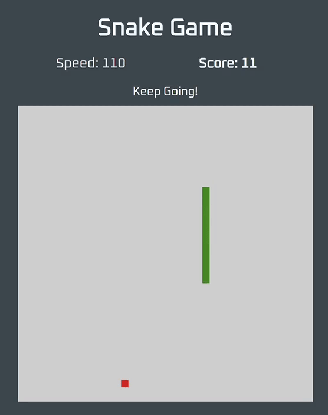

# Snake Game

This is a snake game app using HTML, CSS and plain vanilla javascript. I'm using canvas to render graphics. I find building this app quite challenging because I have to rethink how logic are implemented. It's not just as simple as DOM manipulation. 

 

Don't you miss playing those 8-bit computer games from the 80s? Anyway, give it a try. Next thing you know you will get addicted in playing these simple games from the past. 

 
 
 
 
 
 
 
 
 
 

:+1: :sparkles: :tada: :rocket: :metal: :octocat:

## Author 
Paul Caoile Front-end Developer 